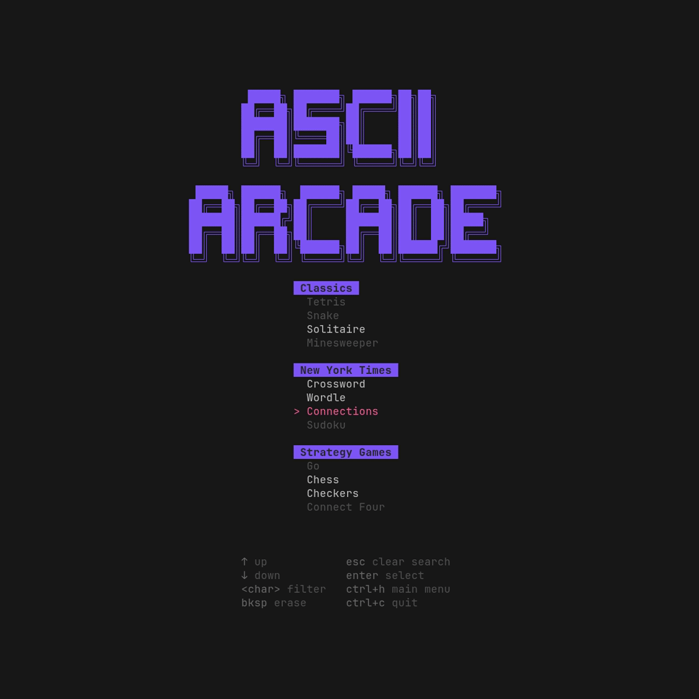
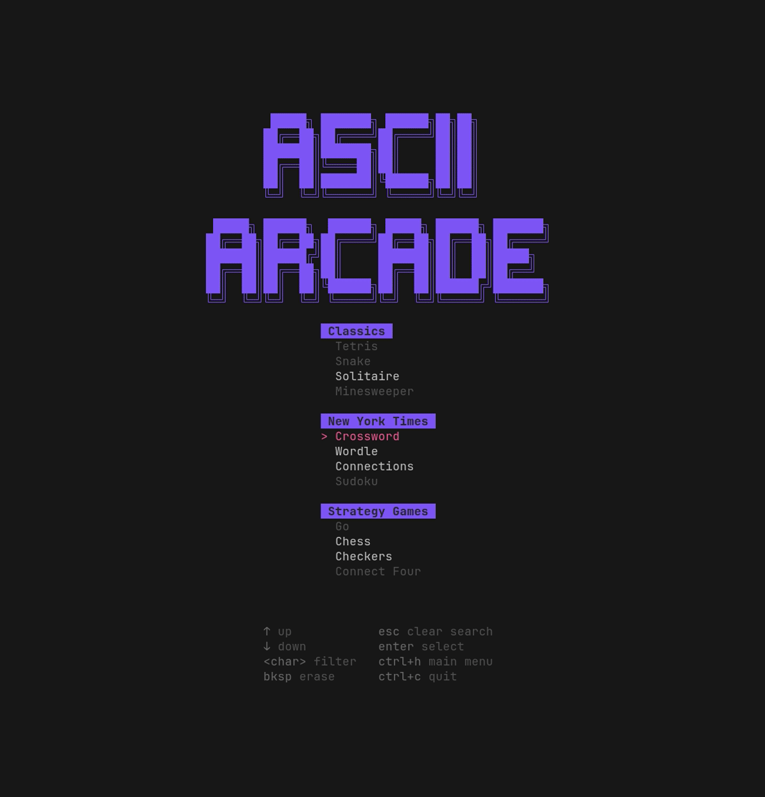
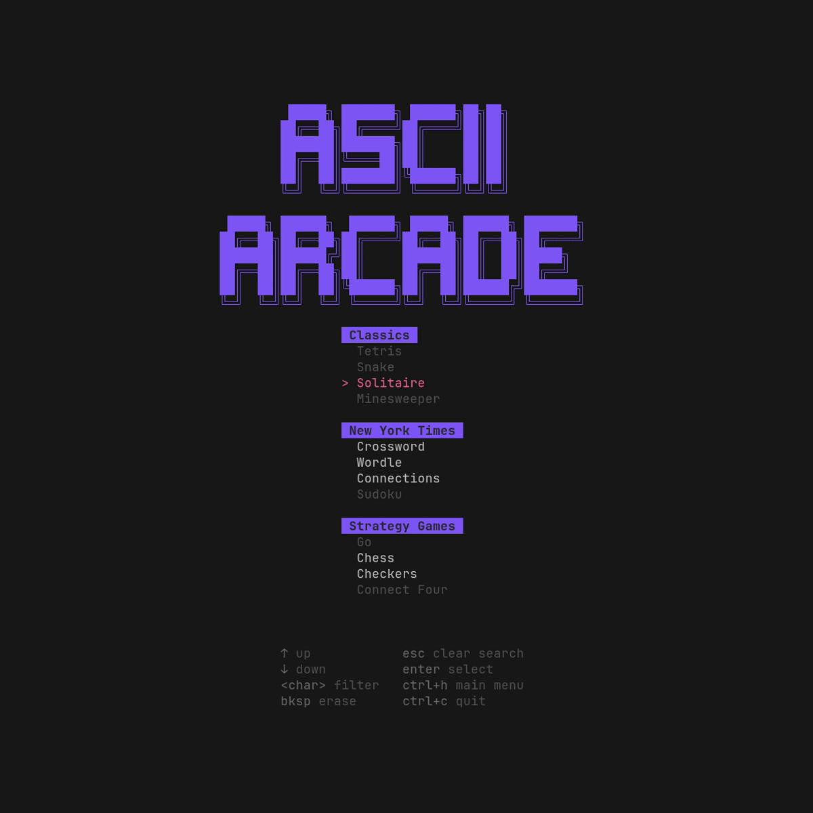
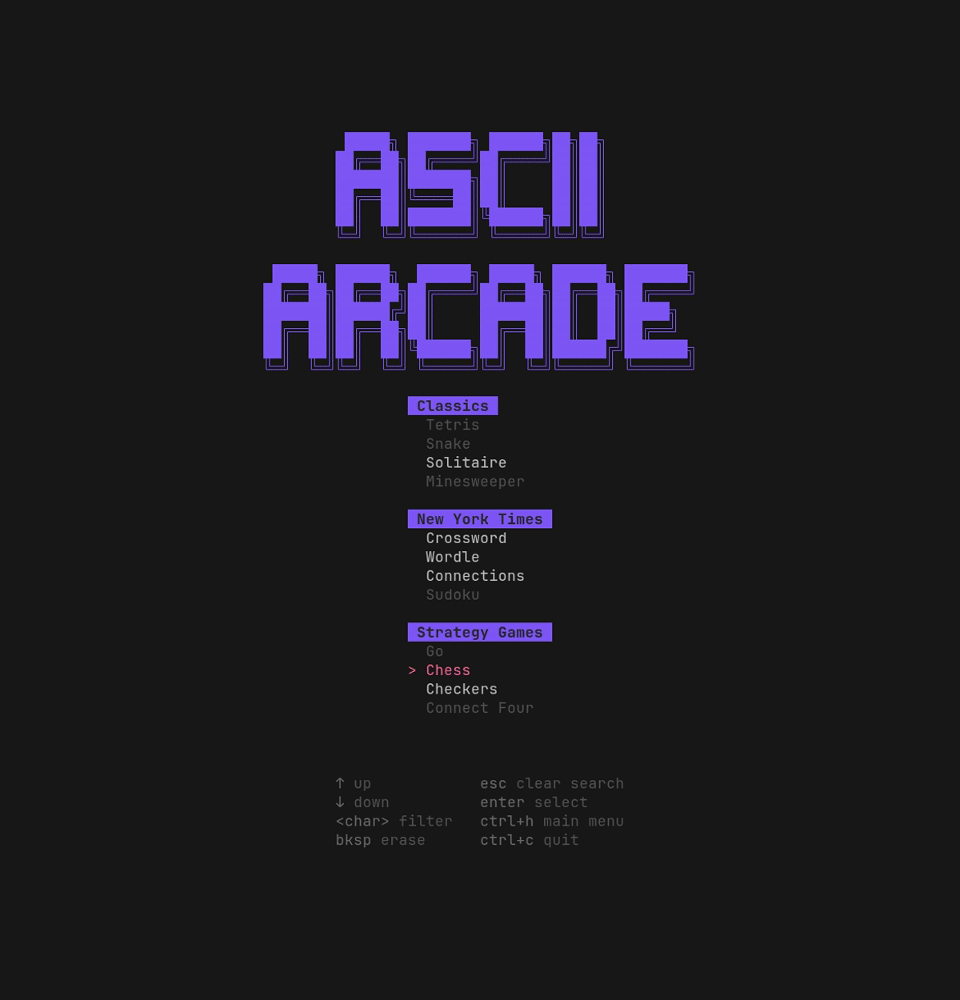

# Ascii Arcade

**Ascii Arcade** is a terminal-based game suite featuring text-mode versions of classic and modern games, all in your terminal. The interface is styled with `lipgloss`, interactive via `bubbletea`.


## Installation

```bash
git clone https://github.com/myka0/ascii-arcade.git
cd ascii-arcade
go build ./cmd/ascii-arcade
./ascii-arcade
```

> Requires **Go 1.24+**

## Usage

After launching the app, navigate the menu using either the arrow keys or your mouse. Choose a game to begin playing.

### Global Shortcuts

These shortcuts work from anywhere in the app:

* `?` - Open the help menu
* `ctrl+h` - Return to the home screen
* `ctrl+c` - Quit the application

### Game Controls

Each game comes with its own unique keybindings and mouse interactions. You can view these inside the game’s help menu.

## Included Games

### NYT Wordle

Guess the daily five-letter word in six tries.

* Fetches latest puzzle directly from NYT API
* Data is saved automatically to a local **SQLite** database


### NYT Connections

Group 16 words into 4 themed categories.

* Fetches latest puzzle directly from NYT API
* Data is saved automatically to a local **SQLite** database



### NYT Crossword

Full crosswords from the NYT archive.

* Fetches latest puzzle directly from NYT API
* Data is saved automatically to a local **SQLite** database



### Solitaire

Classic Klondike solitaire.



### Chess

Classic two-player chess.



### Checkers

Traditional American checkers.


## Game Data Sources

The following games use data fetched from **The New York Times public APIs**:

* **Wordle** - [https://www.nytimes.com/svc/wordle/v2/{date}.json](https://www.nytimes.com/svc/wordle/v2/)
* **Connections** - [https://www.nytimes.com/svc/connections/v2/{date}.json](https://www.nytimes.com/svc/connections/v2/)
* **Crossword** - [https://www.nytimes.com/svc/crosswords/v6/puzzle/daily/{date}.json](https://www.nytimes.com/svc/crosswords/v6/puzzle/daily/)

## Saving & Progress

NYT Games supports automatic saving/loading per date.

Data is saved automatically to a local **SQLite** database at:

```
data/wordle/solitaire.db
data/connections/solitaire.db
data/crossword/crossword.db
```

## Acknowledgments

* [`bubbletea`](https://github.com/charmbracelet/bubbletea) - terminal UI framework
* [`lipgloss`](https://github.com/charmbracelet/lipgloss) - for styling terminal components
* [`zone`](https://github.com/lrstanley/bubblezone) - mouse support and click tracking
* **The New York Times** - for inspiring games and puzzle data
* [`clidle`](https://github.com/ajeetdsouza/clidle) - wordle inspiration
* [`charmed-nyt-connections`](https://github.com/mfonism/charmed-nyt-connections) - connections inspiration
* [`solitaire-cli`](https://github.com/brianstrauch/solitaire-tui) - solitaire inspiration
* [`gambit`](https://github.com/maaslalani/gambit) - chess inspiration
* [`BubbleUp`](https://github.com/DaltonSW/BubbleUp) - overlay inspiration

